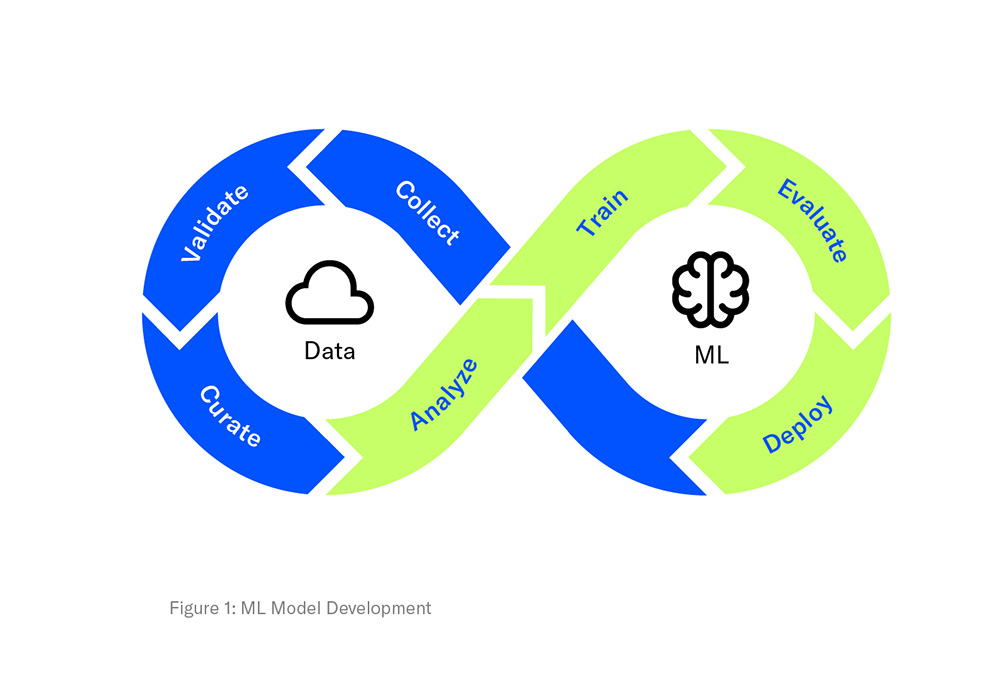
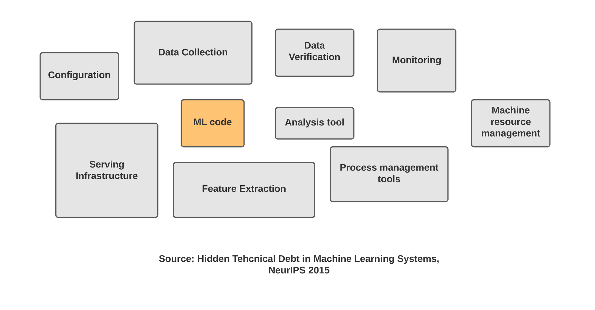

# Sara-Zeus Breast Cancer Prediction App :stethoscope: :cherry_blossom:
# Empowering Precision, Embracing Hope 
***


## Objective
This repository hosts the code for a specialized Breast Cancer Prediction App tailored for cytology labs. By harnessing machine learning techniques and utilizing the [Wisconsin Breast Cancer Dataset from Kaggle](https://www.kaggle.com/datasets/uciml/breast-cancer-wisconsin-data), my project aims to develop a predictive tool for identifying breast tumor malignancy. 
 - :reminder_ribbon: [App Link](https://sara-zeus-breast-cancer-prediction-app.streamlit.app)
- Specifically designed for lab technicians, the app interprets cellular morphological features extracted from fine needle aspirate (FNA) samples.
- MLOps streamlines the complex machine learning lifecycle, coordinating tasks from data ingest to model deployment. It fosters collaboration across teams—Data Engineering, Data Science, and ML Engineering—requiring stringent operational standards to synchronize processes.
- For this project I decided to use ZenML, an Open-source MLOps framework facilitating portable, production-ready machine learning pipelines. 
- Benefits of MLOps include:

Efficiency: 
- Faster model development, high-quality ML models, and swift deployment.
- Scalability: Management of numerous models, facilitating continuous integration and deployment.
- Risk Reduction: Enables regulatory compliance, drift-check, and faster response to requests, ensuring transparency and policy adherence. 


# Why MLOps Matters
***


Building a machine learning model isn't the end game. MLOps—Machine Learning Operations—is vital for reproducibility and success in a production environment. MLOps ensures scalability, collaboration, and reproducibility throughout the machine learning lifecycle.

## MLOps: Solving Problems and Best Practices

MLOps addresses issues like versioning, monitoring model performance, and efficient feature generation. It ensures consistency, prevents degradation, and streamlines feature creation, allowing data scientists to focus on refining models.

## Skills for MLOps

For successful MLOps, teams need skills in problem articulation, data collection, preparation, model creation, pipeline development, deployment, and real-world monitoring.

## Key Components of MLOps

MLOps comprises various components, including a feature store for efficient feature storage, data versioning for reproducibility, ML metadata for comprehensive logging, and model serving and monitoring for performance checks.

## Model Management and CI/CD in MLOps

Model versioning, registry, serving, monitoring, retraining, and continuous integration/deployment are essential aspects ensuring models perform optimally and adapt to changing data.

## Implementing MLOps

Creating an MLOps system or using pipeline orchestration tools like MLflow, Sacred, and ModelDB streamlines workflows and automates processes.

## Best Practices in MLOps

Collaborative tools, starting simple, quick launches, automated testing, and model deployment are key practices ensuring success in MLOps.
 



## Functionality
- **Data Input:** Users have the flexibility to input data manually or connect their devices for a streamlined analysis.
- **Visualization:** The app provides a radar chart illustrating critical cellular characteristics.
- **Prediction:** It offers predictions regarding tumor classification as benign or malignant.

## Features
Derived from digitized images of FNA samples from breast masses, the app's analysis centers on Cellular Morphological Features. It serves as a valuable tool for laboratory technicians, aiding in the prediction of breast cancer based on tissue samples.

## Dataset
The underlying machine learning model is trained on the [Wisconsin Breast Cancer Dataset from Kaggle](https://www.kaggle.com/datasets/uciml/breast-cancer-wisconsin-data), enhancing accuracy and reliability.


## Project Structure


```sql


├── app                      <- Folder For All The Streamlit App Code  
│   ├── app.py                    <- my streamlit app 
│   ├── requirements.txt          <- list of all dependencies 
│
├── assets                   <- Supplementary Resources
│   ├── style.css                 <- styling code
│  
├── data                     <- Data Folder 
│   ├── data.csv                  <- data source
│   
├── images                   <- Images Used in the Project 
│   ├── body_logo.png             <- application logo   
│   ├── heart_logo.png            <- heart logo 
│ 
├── model                    <- Source code
│   ├── main.py                   <- the main 
│   ├── model.pkl                 <- serialized model file
│   ├── scaler.pkl                <- serialized scaler file
│
├── pipelines                <- Pipeline Orchestrators 
│   ├── deployment_pipeline.py    <- automated deployment orchestrator 
│   └── training_pipelines.py     <- model training orchestrator
│   
├── src                      <- Source Code 
│   ├── data_cleaning.py          <- code for data cleaning 
│   ├── evaluation.py             <- code for evaluation 
│   └── model_dev.py              <- code for model development 
│ 
├── steps                    <- Aatomic Aomponents Of ZenML Pipelines 
│   ├── clean_data.py             <- data cleaning step                   
│   ├── config.py                 <- configuration settings  
│   ├── evaluation.py             <- evaluation step         
│   ├── ingest_data.py            <- data ingestion step 
│   └── model_train.py            <- model training step            
│ 
├── __init__.py              <- Package Initializer
├── run_deployment.py        <- Deployment Script
├── run_pipeline.py          <- Pipeline Executor            
└── README.md                <- Project Documentation


```
## 🚀 Lets look at the code 
***


## The Streamlit App
To run the Streamlit App, run the following command: 

```python
streamlit run app/app.py

```

## To Run the Pipelines: 

```python
python run_pipeline.py

```
```python
python run_deployment.py
```
